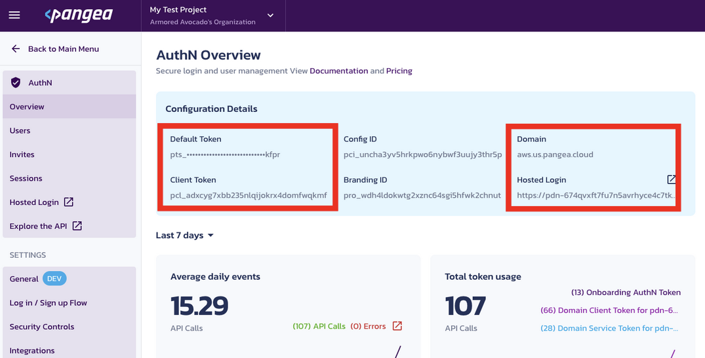
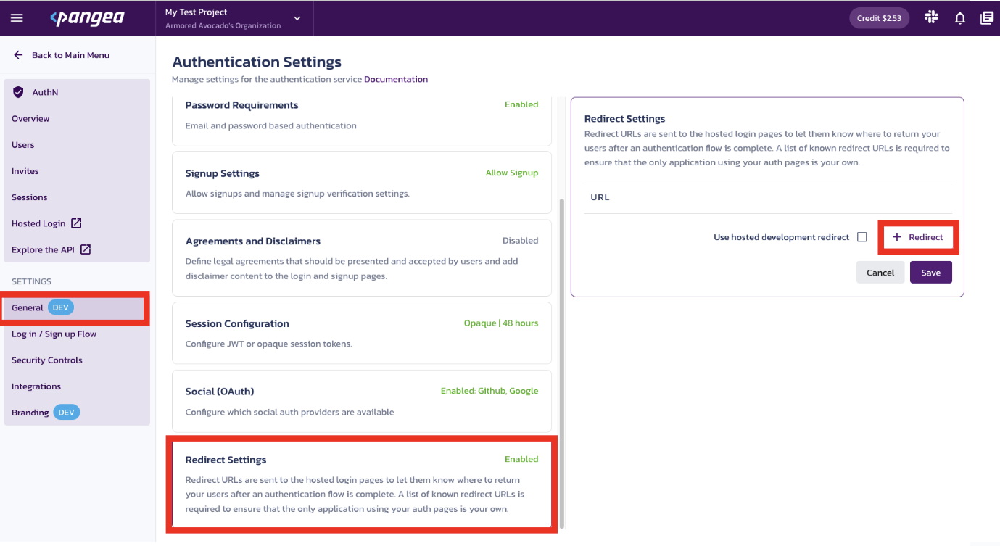

This is a [Next.js](https://nextjs.org/) project bootstrapped with [`create-next-app`](https://github.com/vercel/next.js/tree/canary/packages/create-next-app).

## Getting Started

To run this application, we are going to need to configure the following Pangea Services:
- AuthN
- IP Intel
- User Intel
- Secure Audit Log

Please follow the instructions below on how to do so.

## Pre Reqs Check
In order to run this application you are going to need: 
 - Node (available via codespace)
 - Pangea Account

 ## Enable Pangea Services
1. Create and sign into your [Pangea account](https://console.pangea.cloud/)

2. Once you land on the Pangea User Console, You can see AuthN, Secure Audit Log, Redact, and Vault on the left.
   
3.  Select **AuthN** to enable and begin the token creation process.

4. Landing on the **AuthN Service Overview** page you'll see all the token information you will need from Pangea to run the application. We will fill out the .env file with these values later.


5. Go to the Redirects tab and add the necessary redirect. If running this in codespace, it's the url of your codespace running instance. 
If running this app locally, add http://localhost:3000 to the redirect list. This is also go to a good time to go to General Settings and decide what methods of Login or MFA you need for your application. On first run it is reccomended to do this in a bare bones way. 


> NOTE: By going to **Customize > View project branding**, you'll be able to customize your login page

7. Enable **Secure Audit Log** with the default configuration. The only required fields though should be message and timestamp. Remember to extend the existing token, not to create a new one.

8. Enable **IP Intel** and **User Intel** as well. Remember to extend the existing token, not to create a new one.

## First Run
1. Copy the appropriate values into the .env.example file. These can be found in the AuthN Overview page
    - Pangea Service Token
    - Pangea Domain
    - Pangea AuthN Client Token
    - Pangea Hosted Login URL

2. Rename .env.example to just .env

3. Let's run the development server:

```bash
npm run dev
```

4. Open [http://localhost:3000](http://localhost:3000) with your browser to see the result. If you are running this application in a codespace, you will be prompted to a specific URL.


## Deploy on Vercel

The easiest way to deploy your Next.js app is to use the [Vercel Platform](https://vercel.com/new?utm_medium=default-template&filter=next.js&utm_source=create-next-app&utm_campaign=create-next-app-readme) from the creators of Next.js.

Check out our [Next.js deployment documentation](https://nextjs.org/docs/deployment) for more details.
